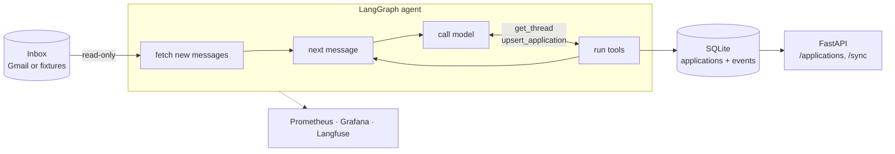

# apply-agent

An LLM agent that keeps track of job applications by reading an email inbox,
**read-only**. It classifies replies (rejection, interview invitation, request
for information, offer, other), extracts company / role / date / summary, and keeps a
table of applications and their current status.

[](https://github.com/jbsanchezr/apply-agent/actions/workflows/ci.yml)

[](LICENSE)

**Stack:** LangGraph · Claude or a local model via Ollama · FastAPI ·
SQLAlchemy · Prometheus · Grafana · Langfuse · Docker · GitHub Actions

## Highlights

* **Runs with zero credentials.** Out of the box it reads bundled synthetic
  emails and uses a keyword baseline, so `docker compose up` works on any
  machine. A free local LLM (Ollama) or Claude is one environment variable away.
* **Measured, not assumed.** An evaluation harness runs the *whole agent* over
  26 labelled emails and reports per-class precision/recall, confidence
  intervals and a confusion matrix. The local `qwen3:8b` model goes from the
  baseline's 73% accuracy to 100% (with an honest caveat, below).
* **Read-only by design.** The Gmail integration asks only for
  `gmail.readonly`, rejects broader tokens, and exposes a read-only interface.
  Email bodies are never stored or logged.
* **Contained against prompt injection.** The model gets only two tools, both
  bound to the email being processed, so a malicious email can at worst get
  itself misclassified.
* **Observable.** Prometheus metrics (tokens, cost, latency, outcomes), a
  19-panel Grafana dashboard that is tested against the code, and optional
  Langfuse traces.
* **Reproducible CI for free.** LLM responses are recorded once and replayed,
  so CI re-runs the LLM evaluation on every push without a GPU or API key.
* **Documented trade-offs.** 45 design decisions, with their reasons, in
  [DECISIONS.md](DECISIONS.md).

## How it works



1. The graph lists new messages itself. Choosing what to read needs no
   judgement, and this keeps the cost of a sync predictable.
2. Each email gets a **fresh, short conversation** with a step budget, so one
   confusing email cannot derail the rest of the inbox.
3. The model's only way to answer is an `upsert_application` tool call
   validated by a strict Pydantic schema. Validation errors go back to the
   model so it can correct itself.
4. Every message becomes an immutable **event**, and an application's status
   is **derived** from its events (applied → information requested →
   interviewing → offer / rejected), never overwritten.
5. An email that fails (model error, refusal, budget exhausted) is not
   recorded, so the next sync retries it.

## Run it

With Docker, one command starts the API, Prometheus and Grafana:

```bash
docker compose up --build
```

* <http://localhost:8000/applications>: the applications table. Log in with any
  username and the token printed in the app logs (`docker compose logs app`),
  or set `APPLY_AGENT_API_TOKEN` in a `.env` file. Press *Sync now*.
* <http://localhost:3000>: the Grafana dashboard. <http://localhost:9090>: Prometheus.

API (the token also works as `Authorization: Bearer <token>`):

| Endpoint | |
|---|---|
| `GET /applications` | HTML table; JSON with `?format=json` or `Accept: application/json` |
| `POST /sync` | Starts a background sync: `202` with a job id, or `409` if one is running |
| `GET /sync/{job_id}` | Job status and report |
| `GET /metrics` | Prometheus metrics (no personal data, no auth) |
| `GET /healthz` | Liveness |

Without Docker:

With no configuration, the agent reads the bundled fixture emails and uses a
keyword baseline instead of an LLM, so no credentials are needed:

```bash
uv sync
uv run python -m apply_agent sync
```

To classify with a free local LLM, install [Ollama](https://ollama.com), run
`ollama pull qwen3:8b`, and set `APPLY_AGENT_LLM=ollama`. Email content never
leaves your machine. To use Claude instead, set `ANTHROPIC_API_KEY` and
`APPLY_AGENT_LLM=anthropic`.
All settings are listed in [.env.example](.env.example).

## Evaluation

```bash
uv run python scripts/evaluate.py              # keyword baseline, no API key
uv run python scripts/evaluate.py --llm ollama # local model, free
```

This runs the full agent over the 26 labelled fixtures and prints per-class
precision/recall, accuracy with a 95% confidence interval, a confusion matrix
and the misclassified cases.

| Model | Category accuracy (95% CI) | Macro-F1 | Job-application flag | Company | Role |
|---|---|---|---|---|---|
| Keyword baseline | 73.1% (54-86%) | 0.77 | 88.5% | 27% | 27% |
| `qwen3:8b`, local via Ollama | 100% (87-100%) | 1.00 | 100% | 86% | 95% |

Cost and latency per LLM call, from the same runs: the local model makes 1.08
calls per email (about 1,000 tokens in, 460 out, reasoning included), costs $0,
and takes 28.8 s at p50 and 85 s at p95 on a laptop RTX 4050.

Read the 100% as an upper bound: 26 examples, written by the same author as
the prompt (see D36 in [DECISIONS.md](DECISIONS.md)). The local model's
mistakes are naming variants ("Cinderpeak" vs "Cinderpeak Games"), not
hallucinations. Full results are in [eval_results/](eval_results/).

The local model's responses are recorded, so the LLM evaluation can be
reproduced in seconds without Ollama:

```bash
uv run python scripts/evaluate.py --llm ollama --replay eval_results/recordings/qwen3-8b.json
```

## Observability

* **Prometheus**: sync runs and duration, messages by outcome and category,
  model calls per message, tool calls, LLM latency, tokens and estimated spend,
  and applications by status (read from the database at scrape time). Served
  on `/metrics` by the API (M6).
* **Grafana**: [deploy/grafana/dashboards/apply-agent.json](deploy/grafana/dashboards/apply-agent.json),
  19 panels. A test checks that every query uses a metric the code exposes.
* **Langfuse** (optional, `APPLY_AGENT_LANGFUSE_ENABLED=true`): one trace per
  sync, one span per email, with model calls and tool calls nested under it.
  Email bodies are redacted by default.
* **Logs**: JSON lines with `thread_id` and `message_id` as correlation ids,
  never email content.

## Development

Requires Python 3.12 and [uv](https://docs.astral.sh/uv/).

```bash
uv sync
uv run ruff check . && uv run ruff format --check .
uv run mypy
uv run pytest
```

## Test data

All email fixtures in `tests/fixtures/emails` are synthetic. Every address and
URL uses a reserved domain (`*.example`, `example.com`, `*.test`), and a test
fails the build if a non-reserved domain appears.

## Using a real Gmail inbox (optional)

Access is read-only (`gmail.readonly`). The agent cannot send, delete or modify
mail, and refuses tokens with any broader scope.

1. In Google Cloud, create an OAuth client of type *Desktop app* with the
   Gmail API enabled, and save its JSON to
   `~/.config/apply_agent/client_secret.json`.
2. Run the one-time consent flow:
   `uv run python -m apply_agent.providers.gmail_auth`
3. Set `APPLY_AGENT_EMAIL_PROVIDER=gmail`.

## Limitations and next steps

* **Small evaluation set.** 26 synthetic emails written by the same author as
  the prompt. The next step is a larger, independently labelled set, and a
  comparison of cheaper Claude models against the local one.
* **Local latency.** `qwen3:8b` takes about 30 s per email on a laptop GPU.
  Fine for a background sync, too slow for anything interactive.
* **No dead-letter queue.** An email that always fails is retried on every
  sync. Moving it aside after N attempts is the planned fix.
* **Single user.** One API token and SQLite with `create_all`. Multi-user use
  would need real auth, Postgres and migrations (Alembic).
* **Dates mentioned in an email** (interview time, deadline) are not extracted
  yet. The event date is the email's `Date` header.

## License

[MIT](LICENSE)
